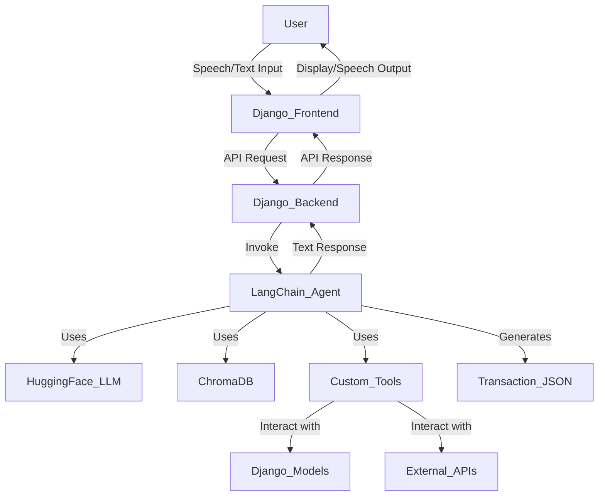

# AI Agent Architecture Design for My Easy Transfer

## 1. Introduction

This document outlines the proposed architecture for replacing the existing Groq-based chatbot and `transaction_processor.py` in the My Easy Transfer application with a more advanced AI agent. The new system will leverage LangChain for orchestration, Hugging Face models for natural language processing, and ChromaDB for efficient vector storage and retrieval. This transition aims to enhance the intelligence, flexibility, and maintainability of the transaction guidance and processing system.

## 2. Goals

The primary goals of this architectural redesign are:

*   **Intelligent Conversation**: Develop a conversational AI agent capable of understanding complex user requests, guiding users through transaction processes (transfers and recharges), and clarifying ambiguities.
*   **Robust Transaction Processing**: Accurately extract and validate transaction details from natural language input, ensuring data integrity before confirmation.
*   **Contextual Awareness**: Maintain conversation history and user-specific data to provide personalized and contextually relevant responses.
*   **Scalability and Flexibility**: Design a modular system that can easily integrate new AI models, tools, and data sources.
*   **Improved Maintainability**: Reduce reliance on hard-coded regex patterns and business logic by centralizing decision-making within the AI agent.

## 3. High-Level Architecture

The new AI agent architecture will consist of the following main components:

## 4. Component Breakdown

### 4.1. LangChain Agent

The LangChain agent will be the central orchestrator of the transaction process. It will be responsible for:

*   **Understanding User Intent**: Determining whether the user wants to initiate a transfer, recharge, confirm details, or correct information.
*   **Information Gathering**: Proactively asking for missing transaction details (recipient name, address, phone number, amount, operator).
*   **Tool Utilization**: Calling specific tools to perform actions like validating input, interacting with Django models, or generating the final transaction JSON.
*   **Conversation Management**: Maintaining the state of the conversation and guiding the user through the necessary steps.
*   **Response Generation**: Formulating natural language responses to the user.

The agent will likely be an `AgentExecutor` with access to a set of predefined `Tools` and a `ChatPromptTemplate` to manage the conversation flow.

### 4.2. Hugging Face Models

Hugging Face models will be integrated for various NLP tasks:

*   **Large Language Model (LLM)**: A suitable Hugging Face LLM (e.g., from the `transformers` library) will be used as the brain of the LangChain agent for understanding user input and generating responses. This replaces the current Groq API integration.
*   **Embeddings Model**: A Hugging Face embeddings model will be used to convert text (e.g., transaction details, user queries) into numerical vector representations. These embeddings are crucial for ChromaDB.

### 4.3. ChromaDB

ChromaDB will serve as the vector store for the AI agent. It will be used for:

*   **Contextual Memory**: Storing vectorized representations of past conversation turns, user preferences, and potentially structured transaction data. This allows the agent to recall relevant information from previous interactions.
*   **Information Retrieval**: Enabling the agent to retrieve relevant pieces of information (e.g., common transaction patterns, known recipient details) based on the current conversation context.
*   **Knowledge Base**: Potentially storing a knowledge base of transaction rules, country restrictions (Tunisia and Morocco only), and operator details, allowing the agent to query this information to validate user input.

### 4.4. Custom Tools

The LangChain agent will interact with the existing Django application and potentially external services through custom tools. These tools will encapsulate specific functionalities:

*   **`ValidateTransactionDetailsTool`**: A tool to validate extracted transaction details (e.g., checking if an address is in Tunisia or Morocco, validating phone number format).
*   **`GenerateTransactionJSONTool`**: A tool to generate the final JSON file containing all confirmed transaction details.
*   **`UpdateUserProfileTool`**: A tool to update or retrieve user profile information from Django models.
*   **`CheckBiometricVerificationTool`**: A tool to check the status of biometric verification.

### 4.5. Integration with Django

The Django backend will act as an intermediary between the frontend and the LangChain AI agent. The `views.py` will be modified to:

*   Receive user input (speech-to-text or text).
*   Pass the input to the LangChain agent.
*   Receive the agent's response.
*   Send the response back to the frontend.
*   Manage session data for conversation history and pending transaction details.

## 5. Data Flow

1.  **User Input**: The user provides speech or text input via the Django frontend.
2.  **Frontend to Backend**: The frontend sends the input to a Django view (e.g., `/menu/chatbot/`).
3.  **Backend to LangChain**: The Django view passes the user's message and current session context (chat history, pending transaction data) to the LangChain agent.
4.  **LangChain Processing**: The agent processes the input:
    *   It uses the Hugging Face LLM to understand the intent and extract entities.
    *   It queries ChromaDB for relevant contextual information or knowledge.
    *   It decides which custom tool to use (e.g., `ValidateTransactionDetailsTool`, `GenerateTransactionJSONTool`).
    *   The chosen tool executes its logic, potentially interacting with Django models or external APIs.
    *   The tool's output is fed back to the agent.
5.  **Response Generation**: The agent generates a natural language response based on the tool's output and the overall conversation state.
6.  **LangChain to Backend**: The agent returns the response (and any updated transaction data) to the Django view.
7.  **Backend to Frontend**: The Django view sends the response back to the frontend.
8.  **User Output**: The frontend displays the response to the user (text or text-to-speech).

## 6. Advantages of New Architecture

*   **Enhanced Intelligence**: Leverages advanced LLMs for better understanding and more natural conversations.
*   **Reduced Hard-coding**: Minimizes the need for complex regex and conditional logic in `transaction_processor.py` by delegating decision-making to the AI agent.
*   **Improved Context Management**: ChromaDB provides a robust mechanism for storing and retrieving conversational context and domain-specific knowledge.
*   **Modularity**: LangChain's modular design allows for easy swapping of LLMs, embedding models, and tools.
*   **Future Extensibility**: Simplifies the addition of new transaction types, verification methods, or external integrations.

## 7. Implementation Steps (High-Level)

1.  Install necessary Python packages (LangChain, Hugging Face `transformers`, `sentence-transformers`, `chromadb`).
2.  Set up ChromaDB instance (in-memory for development, persistent for production).
3.  Define Hugging Face LLM and embeddings models.
4.  Create custom LangChain tools for transaction validation, JSON generation, and Django model interaction.
5.  Develop the LangChain agent with appropriate prompts and memory management.
6.  Modify Django `views.py` to integrate with the LangChain agent.
7.  Thoroughly test the new transaction flow.
8.  Update `requirements.txt` with new dependencies.

---

**Author**: Manus AI
**Date**: March 14, 2026
